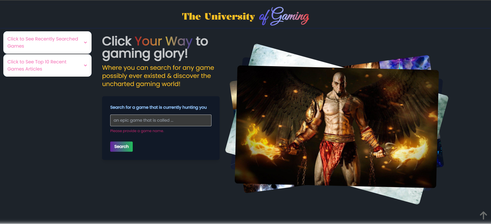
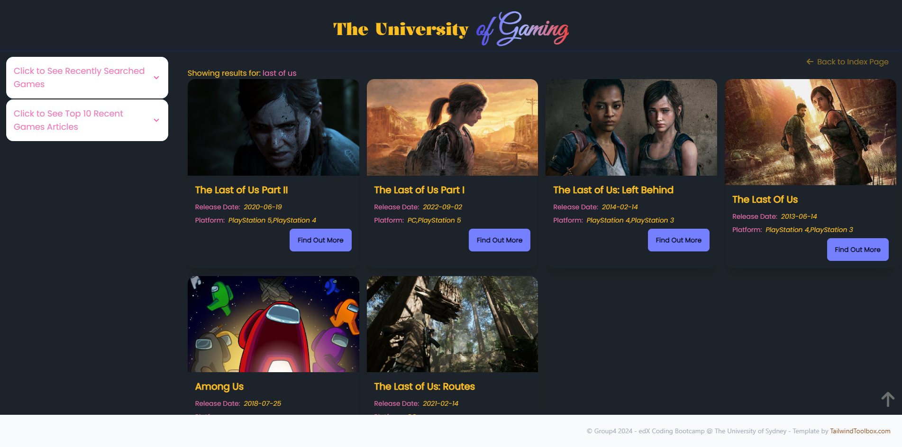
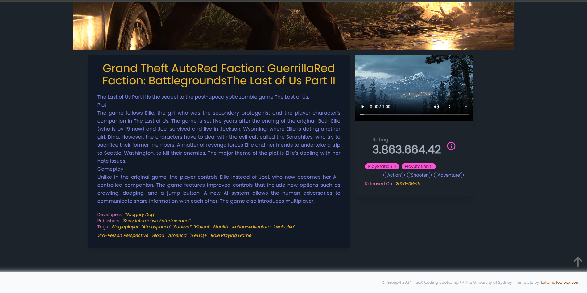

      

# The University of Gaming

## Introduction
Imagine browsing a massive game library: searching for your next adventure with intuitive suggestions, diving into detailed profiles brimming with information, and effortlessly purchasing your chosen game through a trusted provider. Sounds seamless, right? These scenarios explore just that, outlining a user-friendly journey from discovery to deep dive.
This project is built using `HTML`, a CSS framework called `Tawilwind CSS` and `Daisy UI`, with several server-side API's namely `RAWG API` and `Gamespot API`.


## Table of Contents

- [Usage](#Usage)
- [Documentation](#Documentation)
- [Credit](#Credit)
- [License](#license)


## Usage

| Steps                | Details                                                                  |
| -------------------- | ------------------------------------------------------------------------ |
| Live application |  [The University of Gaming](https://yukitoshi12345.github.io/The-University-of-Gaming/)                                                           |
| Clone this repo      | ` git clone git@github.com:Yukitoshi12345/The-University-of-Gaming.git` |
| run on vs | ` cd .. `                                                           |


### Images
Homepage

Search

Details



## Documentation

### APIs Used
- [RAWG game database API](https://rawg.io/apidocs)
- [GameSpot API](https://www.gamespot.com/api/)


#### Chrome Extensions
- CORS: Access-Control-Allow-Origin. This extension is needed for the weekly game articles to come up.


#### User Story
```md
As a junior software developer I have different ideas of new games. 
Also, as A dedicated gamer, My mind is constantly immersed in thoughts of video games.
Whether pondering a new concept or exploring existing titles,
I actively seek information to satisfy my curiosity. 
I eagerly pursue new weekly game articles, 
ensuring I stay informed about latest gaming news.
```

#### Objectives
```md
Scenario: Exploring Game Title
GIVEN: I am on the homepage of The University of Gaming
	WHEN: I search for the game in the search bar
THEN: The search bar should provide instant and relevant suggestions as I type, guiding me through the process of recognising and selecting the game title I am looking for.

Scenario: Viewing Detailed Game Profiles
GIVEN: I have found a game title and clicked on it
	WHEN: I am directed to the detailed game profile page
THEN: The page should display comprehensive information, including title, released date, platforms, developers, publishers, tags, rating, genres, images and a video of the game.  

Scenario: Navigating Recently Searched Games
GIVEN: I am on the homepage of the University of Gaming
	WHEN: I click on recently searched games
THEN: I am presented with the 13 most recent game searches
	WHEN: I click on a game under the most recent game search
THEN: The page guides me through the process of recognising and selecting the game title.

Scenario: Viewing Weekly Video Game Articles
GIVEN: I am on the homepage of the University of Gaming
	WHEN: I click on a list of links under the Weekly Video Game Articles
THEN: I am presented with the news articles in a third party website.
```

### Credit

| Contributors                                                  | Roles                                     | Task
| --------------------                                          | --------------------------------          |---------------------------------------------  |
| [Yukitoshi Imaizumi-Zhou](https://github.com/yukitoshi12345)  | Project Manager, Full-Stack Development   | API, Rendering, Design |
| [Darren Doan](https://github.com/darrendoan)                  | Full-Stack Development                    | API, Rendering, Design |
| [Muhamad Sahid](https://github.com/BrxwnSugxr)                | Full-Stack Development                    | API, Rendering, Design, Local Storage  |
| [Suyash Maharjan](https://github.com/SimpleSuyash)            | Full-Stack Development                    | API, Rendering, Design, Local Storage |


-  API & Guides
-  [Working in Branches](https://thenewstack.io/dont-mess-with-the-master-working-with-branches-in-git-and-github/)
	- [Tutorial RAWG API](https://api.rawg.io/docs/#tag/platforms)
 	- [Tutorial GameSpot API](https://www.gamespot.com/api/documentation)
   	- [Tutorial Tailwind CSS](https://daisyui.com/components/) 
 	 	


## License
This project is licensed under the [MIT License](https://github.com/Yukitoshi12345/The-University-of-Gaming/blob/main/LICENSE).
