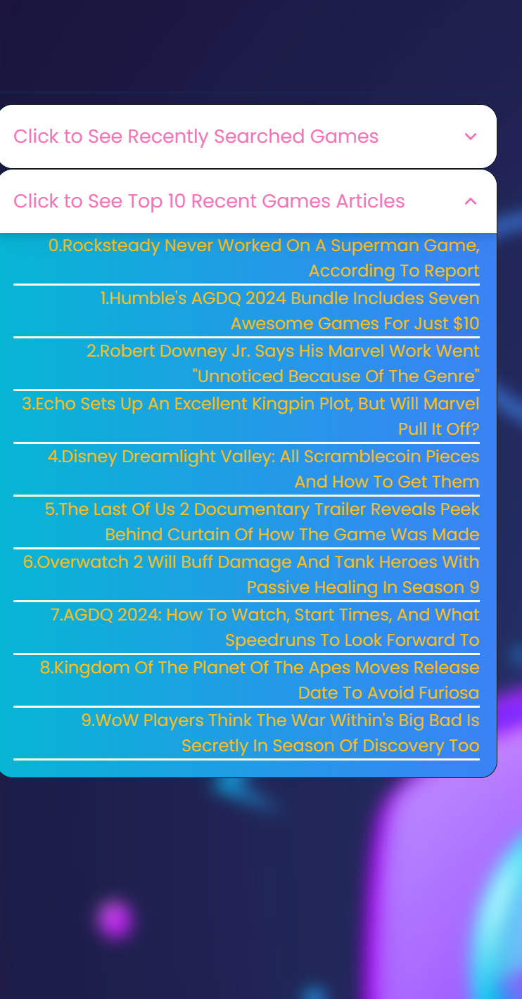

      

# The University of Gaming

## Introduction

As a coding student and an avid video gamer, I often muse on new game ideas. Then as everyone would, I do a google search which presents results relating to the keyword/s I have typed in. But the result is so diverse; it includes from comics to tv shows. And then again, to find the right information(including pictures, video, and so on) I am looking for, I have to endlessly click on the plethora of links. These are the issues *The University of Gaming* aims to solve. By centralizing the search process and limiting the results from two biggest dedicated gaming databases namely *RawG* and *Gamespot*, the process of finding a game you are thinking could not be more simpler. Also, the thoughtfully designed UI/UX is a joy to use rather than tediously pursuing mundane google links. And because this app helps you learn about games and gaming articles, hence it is named **The University of Gaming**.

*The University of Gaming* is a 3 pages app where initially an user can search for a game by typing in keyword/s. The search returns a list of related games in the second page in nicely designed cards with a small picture and title, released date and platforms on it. It displays 6 results/games per page. The user can navigate through these search results by pressing *❮❮Previous Page* and *Next Page❯❯* buttons. A user can also view enlarged picture of a game by clicking on the image on the card. Pressing *Find out More* button on any of the cards will take the user to the third page. This is where the user can see the detailed information about the selected game. The information such as title, description, developers, publishers, platforms, tags, genres, rating and released dates.

The first and second pages also have a section at the left hand side where the user can see the list of top 10 recent gaming news articles. Clicking on the link will open the article in a third party website.


- [Usage](#Usage)
- [Documentation](#Documentation)
- [Credit](#Credit)
- [License](#license)

## User Story
```md
As a junior software developer I have different ideas of new games. 
Also, as A dedicated gamer, My mind is constantly immersed in thoughts of video games.
Whether pondering a new concept or exploring existing titles,
I actively seek information to satisfy my curiosity. 
I eagerly pursue new weekly game articles, 
ensuring I stay informed about latest gaming news.
```

## Acceptance Criteria
```md
Scenario: Exploring Game Title
GIVEN: I am on the homepage of The University of Gaming
	WHEN: I search for the game in the search bar
THEN: The search bar should provide instant and relevant suggestions as I type, guiding me through the process of recognising and selecting the game title I am looking for.

Scenario: Viewing Detailed Game Profiles
GIVEN: I have found a game title and clicked on it
	WHEN: I am directed to the detailed game profile page
THEN: The page should display comprehensive information, including title, released date, platforms, developers, publishers, tags, rating, genres, images and a video of the game.  

Scenario: Navigating Recently Searched Games
GIVEN: I am on the homepage of the University of Gaming
	WHEN: I click on recently searched games
THEN: I am presented with the 13 most recent game searches
	WHEN: I click on a game under the most recent game search
THEN: The page guides me through the process of recognising and selecting the game title.

Scenario: Viewing Weekly Video Game Articles
GIVEN: I am on the homepage of the University of Gaming
	WHEN: I click on a list of links under the Weekly Video Game Articles
THEN: I am presented with the news articles in a third party website.
```
## Usage


| Steps                | Details                                                                  |
| -------------------- | ------------------------------------------------------------------------ |
| Live application |  [The University of Gaming](https://yukitoshi12345.github.io/The-University-of-Gaming/)                                                           |
| Clone this repo      | ` git clone git@github.com:Yukitoshi12345/The-University-of-Gaming.git` |
| run on vs | ` cd .. `                                                           |


## Screenshots
Page 1: Index Page:             


Recently Searched Games:                 


Top 10 recent gaming new articles               


Page 2: Games Page (search results)               


Page 3: Game Details Page                


## APIs Used
- [RAWG game database API](https://rawg.io/apidocs)  
```md   
URL: https://api.rawg.io/api/games?key=[YOUR API KEY]
URL: https://api.rawg.io/api/games/id?key=[YOUR API KEY]
URL: https://rawg.io/api/games/${slug}/screenshots?key=[YOUR API KEY]
```          

- [Gamespot game database API](https://www.gamespot.com/api/) 
```md          
URL: https://www.gamespot.com/api/articles/?api_key=[YOUR API KEY]
URL: https://www.gamespot.com/api/videos/?api_key=[YOUR API KEY]
```             

## Technologies Implemented
- HTML
- CSS
- CSS Framework
	- [Tailwind CSS](https://tailwindcss.com/)
- CSS Component Library
	- [DaisyUI](https://daisyui.com/)
- Javascript
- Javascript Library
	- [jQuery](https://jquery.com/)
- [Google Fonts](https://fonts.google.com/)
- [Font Awesome](https://fontawesome.com/)
- Local Storage


## Contribution/Roles

| Contributors                                                  | Roles                        | Task
| --------------------                                          | -------------------------    |---------------------------------------------  	|
| [Yukitoshi Imaizumi-Zhou](https://github.com/yukitoshi12345)  | Project Manager/Developer	   | Create and Maintain Github Repo<br>Assign  Task and Manage Progress<br>Develop Game Details Feature<br>Create README.md|
| [Darren Doan](https://github.com/darrendoan)                  | Developer                    | Develop Game Search Feature |
| [Muhamad Sahid](https://github.com/BrxwnSugxr)                | Developer     			   | Develop Gaming News Article Feature<br> Prepare Presentation Slideshow  |
| [Suyash Maharjan](https://github.com/SimpleSuyash)            | UI Designer/Technical Lead   |  Lead Coding Team <br> Develop User Interface <br> Develop Game Video and Screenshots Slideshow Feature|

*The roles mentioned above are rough representation of individual memeber's tasks. Thoroughout the project, we all collaborated and contributed to each other's coding.*

## Installation instruction      
- [Install nodejs and npm](https://nodejs.org/en/download)    
Node.js is for npm only. The project doesn't use the Node.js in any other way.
- [Install Tailwind CSS](https://tailwindcss.com/docs/installation)   
Follow the instructions under Tailwind CLI
- CORS: Access-Control-Allow-Origin. This extension is needed to be installed and turned on for the weekly game articles and game video. Please follow the instruction below for more information.    
[https://chromewebstore.google.com/detail/lhobafahddgcelffkeicbaginigeejlf](https://chromewebstore.google.com/detail/lhobafahddgcelffkeicbaginigeejlf)


## License
This project is licensed under the [MIT License](https://github.com/Yukitoshi12345/The-University-of-Gaming/blob/main/LICENSE).
